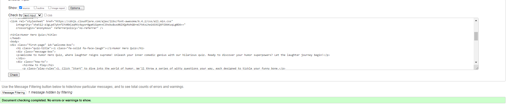

# Humor Hero Quiz

## About

Humor Hero quiz is an online questionnaire designed for those who enjoy creating jokes and riddles.
The quiz will present visitors with funny riddles, allowing them to test their knowledge and learn the correct answers to any they got wrong.

## User experience

This quiz is for those who love a good laugh and want to learn funny riddles.

It is incredibly user-friendly. The first page provides a clear description and instructions on how to play. Simply click the start button to begin the quiz.

+ First time visitor goals
  + To enjoy a good laugh and try to solve the riddles.
  + Learn new riddles that can further tell to their friends when socialising.
  + To easily navigate through it without making extra efforts to get to the end. 

+ Returning and frequent visitor goals
  + To improve their score and remember new riddles. 
  + To tell other friends about it and get them to take the quiz as well. 

## Features

+ This quiz is targeting individuals with a good sense of humor and enjoy reading riddles and also to tell others. 
+ They can see the correct answer to the quiz instantaneously when selecting the wrong answer.
+ User is not able to change their answer once he has selected one. 
+ It is responsive to all kind of devices.

## Existing Features

+ First Page
  
  + The user can read the description of the quiz on the first page to acknowlede its purpose.
  
  + The user can read the instructions on how to play it on the first page in order to be able to understand how to navigate it. 
  
  + The user can begin the quiz only by pressing a simple button called 'Start'.
  
  
+ Questions section

  + The user can see the question number and also how many questions are left until the quiz finishes.
  + The user can see their score increasing while answering the questions.
  
  + The user can see the correct answer straight away after selecting their choice.
  
  
  + User cannot change their response after selecting one. 
  + User can only jump to the next question after they have selected a choice.
  
  
  + User can go to the next question simply by clicking on the 'next question' button after they have chosen the answer. 
  
+ Score result section

  + A different score mesage is popping up for the user depending on their score range. 
  + User can restart the game by pressing on the 'Let's Play Again' button. 
  
    
## Features to be implemented

+  Adding other quiz categories to the website.
+  Adding more questions for the returning users.
+  Adding a section where users can save their score and have a top 5 list.

## Design

+ Colour Scheme
  + Main colours used for the website:

+ Typography
  + The font used is 'Montserrat' sans serif to make sure it will work for all kind of browsers.

## Technologies used

+ HTML5
+ CSS3
+ Java Script5

## Frameworks, Libraries and Programs Used

+ [Codeanywhere](https://app.codeanywhere.com/)
  + To write the code.
+ [Github](https://github.com/)
  + Deployment of the website and storing the files online.
+ [Google Fonts](https://fonts.google.com/)
  + Import main font the website.
+ [Am I Responsive](https://ui.dev/amiresponsive)
  + Mockup picture for the README file.
+ [Hover.css](https://ianlunn.github.io/Hover/)
  + To underline the navigtion links when hovered.
+ [Font Awesome](https://fontawesome.com/)
  + To add icons for the social media pages and for the appointment section.
+ [Favicon](https://favicon.io/)
  + To add the icon for the tab

## Testing

Every page of the project was checked for errors using the W3C Markup Validator, W3C CSS Validator and JSHint services.

+ [W3C Mark-Up Validator](<https://validator.w3.org/>)
+ [W3C CSS Validator](https://validator.w3.org/)
+ [JS Hint](https://jshint.com/)

### Validation Results

index.html

style.css

script.js

No warnings showing up.

### Manual Testing

+ The website was tested on Google Chrome, Microsoft Edge, and Firefox browsers.
+ The website was viewed on a desktop computer, laptop, and an iPhone 13 mobile phone.
+ A large amount of testing was done to ensure links between pages are working correctly on all pages.
+ Friends and relatives were asked to review the website for a better understanding of the user experience.
+ Dev Tools was used to test how the site looks on various screen sizes.

### Solved bugs

+ When replaying the game, I have noticed that the head-display wouldn't show for the first question. This has been fixed and working on order.

### Lighthouse Report

Mobile Analisys

Desktop Analisys

## Deployment and local deployment

### GitHub Pages

GitHub Pages has been used to deploy live version of the website.

1. Log in to GitHub and locate [GitHub Repository Humor Hero Quiz](https://github.com/Monicaular/humor-hero-quiz)
2. On the navigation bar locate "Settings" button on the menu.
3. In the"Code and Automotation" category on the left, find the "Pages" button.
4. Find the "Source" section and change the button that says "none" to "deploy from a branch" and save.
5. Below this, find the "Branch" section and change from "none" to "main" then make sure the next button is on "root" and save.
6. The page should automatically refresh, if not refresh it manually.
7. Scroll back to locate the now-published site [link](https://monicaular.github.io/humor-hero-quiz/) in the "GitHub Pages" section.

## Forking the GitHub Repository

By forking the repository, we make a copy of the original repository on our GitHub account to view and change without affecting the original repository by using these steps:

1. Log in to GitHub and locate [GitHub Repository Humor Hero Quiz](https://github.com/Monicaular/humor-hero-quiz).
2. At the top of the Repository, under the main navigation, find the "Fork" button.
3. Now you there should be a  copy of the original repository in your GitHub account.

## Local Clone

1. Log in to GitHub and locate [GitHub Repository Humor Hero Quiz](https://github.com/Monicaular/humor-hero-quiz)
2. Under the repository name press "Clone or Download"
3. Click on the code button, select clone with HTTPS, SSH or GitHub CLI and copy the link shown.
4. Open Git Bash
5. Change the current working directory to the location where you would like the cloned directory to be made.
6. Type 'git clone' and then paste the URL copied in the step 3.
7. Press Enter and your local clone should be created.

## Credits

### Content

+ All content was written by the developer.
+ [She Codes Colour Pallete](https://palettes.shecodes.io/) was used to decide which colours to use.

### Code

+ Code on how to check the correct answers and the format of the questions was based on [Great Stack on Youtube](https://www.youtube.com/watch?v=PBcqGxrr9g8.)
+ Code on how to disable the click was based on [Great Stack on Youtube](https://www.youtube.com/watch?v=PBcqGxrr9g8.)
+ Code on how to show a head display with the question number and the score was based on [James Q Quick Youtube Tutorial](https://www.youtube.com/watch?v=rFWbAj40JrQ&t=8s)
+ Understanting the concept of functions and methods [Shaun Pelling](https://www.youtube.com/watch?v=xUI5Tsl2JpY)
+ The ReadMe template was provided by [Code Institute](https://github.com/Code-Institute-Solutions/readme-template)

## Acknowledgement

+ Mentor Mitko Bacharov for all the usefull feedback and the availability.
+ Slack Community for encouragement and various informations.
+ Tutors for being there when stucked.
